# Automated Classification of Reflectance Confocal Microscopy (RCM) Images of Nevi with Composite Patterns using Deep Learning and Computer Vision Algorithms

B.Sc. final project, **Afeka Tel-Aviv Academic College of Engineering**
School of Medical Engineering / School of Software Engineering, July 2022

**Author:** [Amit Brilant](https://github.com/Amit-Brilant)
**Supervisor:** Dr. Eyal Katz
**Co-Supervisor:** Prof. Alon Scope, Sheba Medical Center

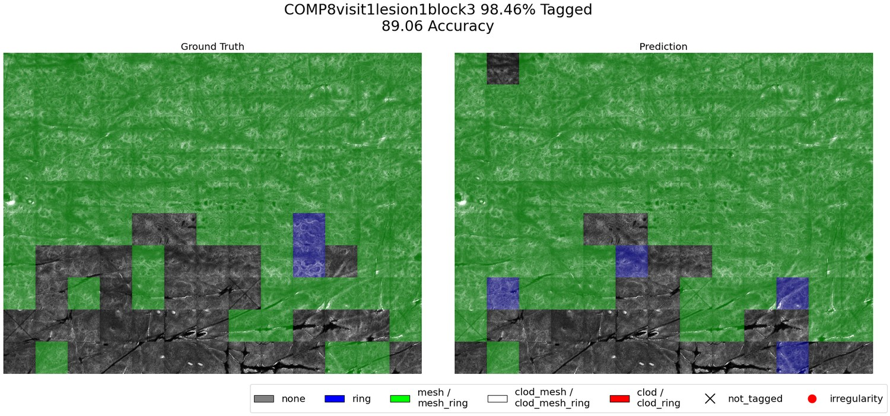

<sub>Left: pattern labels assigned by the medical team. Right: the model's tile-level predictions,
rendered back onto the same mosaic.</sub>

---

## Contents

- [Overview](#overview)
- [Clinical background](#clinical-background)
- [The problem](#the-problem)
- [Goals](#goals)
- [Method](#method)
- [Results](#results)
- [Mosaic Annotation Viewer](#mosaic-annotation-viewer)
- [Repository structure](#repository-structure)
- [Running the code](#running-the-code)
- [Conclusions](#conclusions)
- [Future work](#future-work)
- [Poster](#poster)
- [Credits](#credits)

---

## Overview

Reflectance Confocal Microscopy (RCM) images a patient's skin at cellular resolution without cutting
it, a "virtual biopsy". A single lesion is captured as a **mosaic**: dozens to hundreds of small
**tiles** stitched into one large greyscale image.

Each tile shows one of three cellular patterns (**clod**, **mesh**, **ring**), some combination of
them, or none at all. Reading those patterns is how a dermatologist assesses a mole, and doing it by
eye across hundreds of tiles per lesion is slow and inconsistent between annotators.

This project, run with Prof. Alon Scope's group at Sheba Medical Center, built a ConvNeXt-based
classifier that labels every tile in a mosaic and paints the result back onto the mosaic as a
segmentation map. It reached **90.7% clinically weighted accuracy** on a held-out test set of 717
tiles, along with three secondary outputs: a mosaic-level irregularity index, a proof of feasibility
for identifying pattern prototypes at the mosaic level, and a labelling tool built for the medical
team.

It follows an earlier Afeka project (2020 to 2021) under the same supervisors that classified
**pure** patterns at 94% accuracy. The step taken here is composite patterns, which is a much harder
problem.

---

## Clinical background

Early detection of skin cancer today means stripping the patient and inspecting every mole through a
**dermoscope**. Anything suspicious goes to **biopsy**: minor surgery to excise the lesion and
examine it under a microscope. That is expensive, slow, and leaves scars, which limits how freely it
can be used.

| Dermoscopic examination | Biopsy |
| :---: | :---: |
| 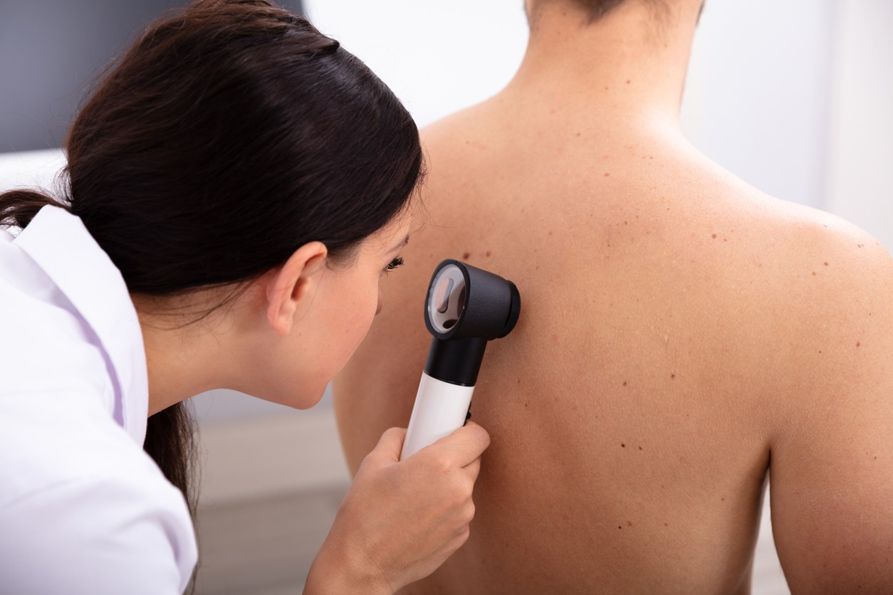 | 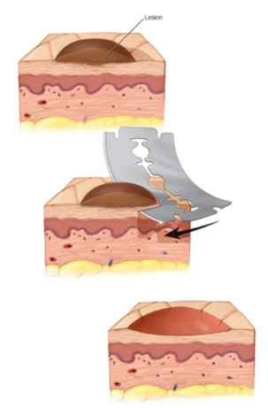 |

**RCM** offers a third option. It images horizontal sections only hundreds of nanometres thick, with
enough contrast and resolution to resolve individual cells, without breaking the skin.

| RCM device | Optical principle |
| :---: | :---: |
| 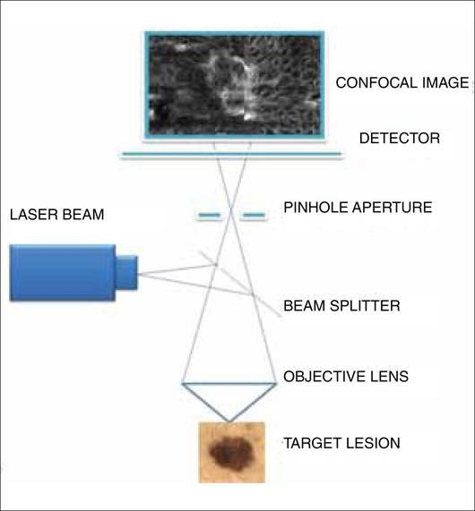 | 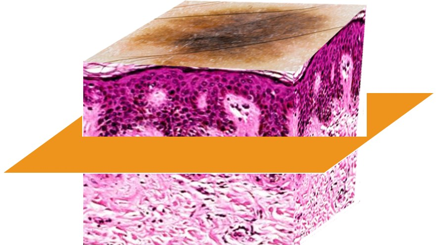 |

The device raster-scans the lesion and the computer stitches the result into a mosaic. The tile is
the unit the medical team labels; the mosaic is the unit they diagnose.

| Mosaic (the whole lesion) | Tile (0.5 mm x 0.5 mm) |
| :---: | :---: |
| 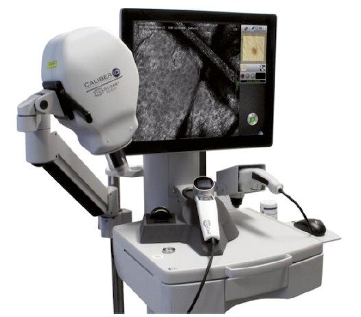 | 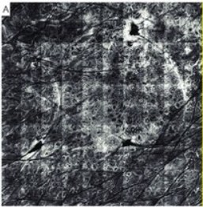 |

---

## The problem

Three pure patterns exist, plus a background class:

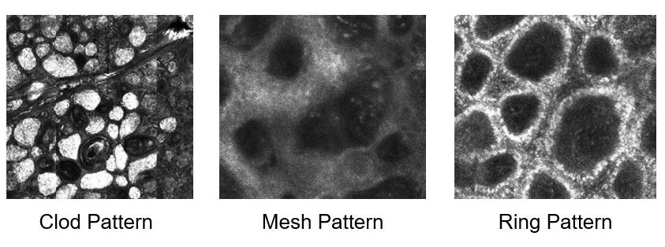

In real nevi they rarely appear alone. They nest inside one another, and a single tile often carries
two or three at once:

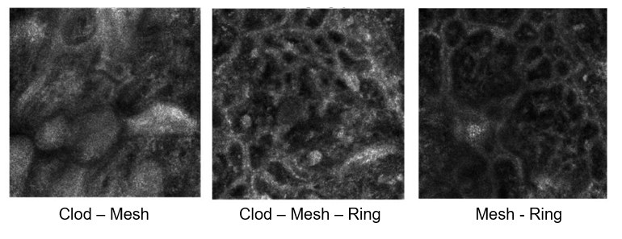

Four tiles from the dataset showing how entangled the patterns get:

| | | | |
| :---: | :---: | :---: | :---: |
| 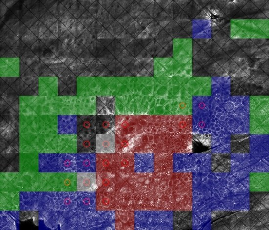 | 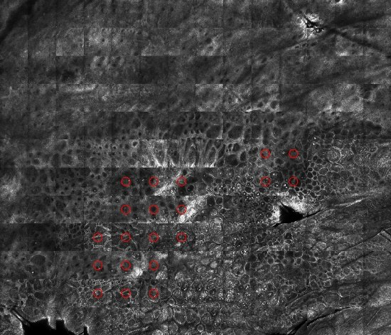 | 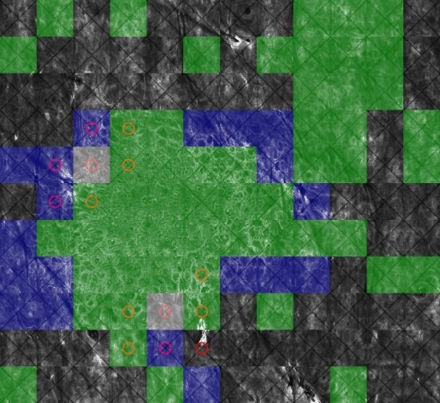 | 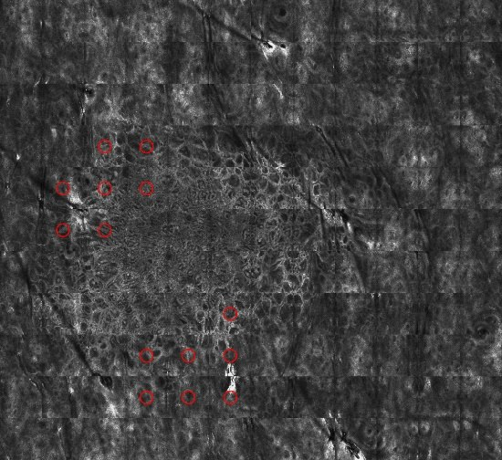 |

The previous project handled pure patterns only, and reached 94%:

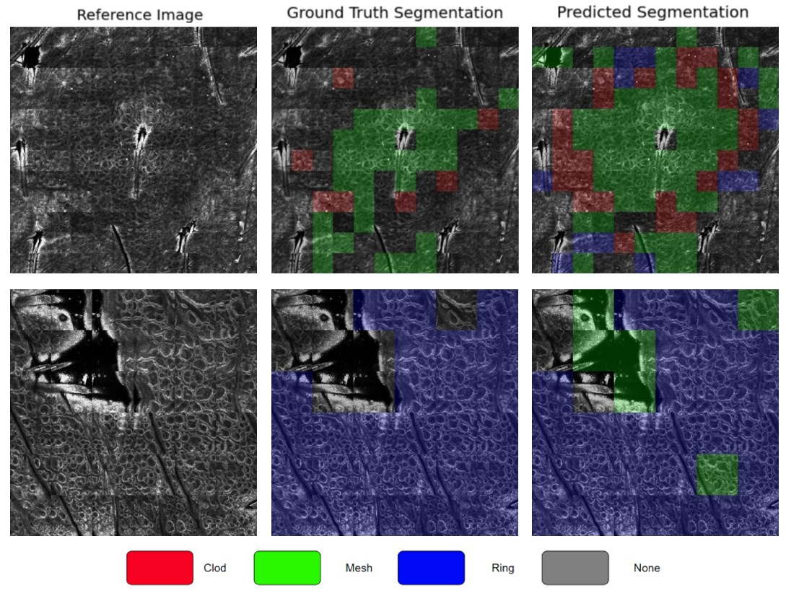

### Segmentation at the tile level, not the pixel level

The literature segments RCM mosaics per pixel. The Sheba team asked for per-tile segmentation
instead, because the tile is the unit they actually reason about and label, and a pixel-level map is
harder for them to act on.

| Pixel-level (literature) | Tile-level (this project) |
| :---: | :---: |
| 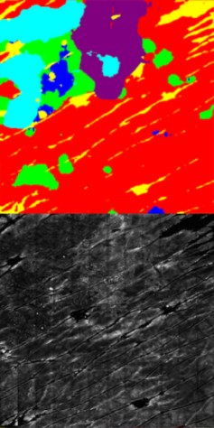 | 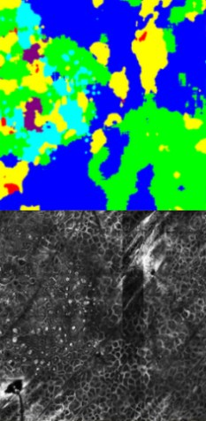 |

### Eight classes down to five

Three patterns plus "none" give eight possible combinations. Training on all eight produced poor
results, and reviewing them with the medical team led to merging classes that are clinically
equivalent. The merge is grounded in the team's own prior studies, not in convenience:

| Original (8) | Merged (5) |
| --- | --- |
| Clod-Mesh, Clod-Mesh-Ring | **Clod-Mesh / Clod-Mesh-Ring** |
| Mesh, Mesh-Ring | **Mesh / Mesh-Ring** |
| Clod, Clod-Ring | **Clod / Clod-Ring** |
| Ring | **Ring** |
| None | **None** |

Fewer, clinically meaningful classes improved the results *and* made a predicted mosaic legible to a
clinician. This turned out to be the single most valuable change in the project.

---

## Goals

1. Build the datasets, including anonymisation of patient data.
2. Classify composite patterns in nevi at the **tile** level.
3. Segment nevus structures at the **mosaic** level.
4. Identify prototypes of nevus patterns at the mosaic level.

All four were met.

---

## Method

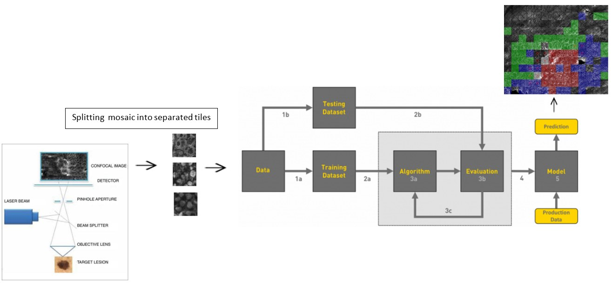

### Dataset

The medical team delivered mosaics in batches every few months. A Python script split each mosaic
into tiles for labelling, then reassembled labelled tiles back into a coloured mosaic.

| | |
| --- | --- |
| Mosaics received | 98 |
| Tiles total | 12,709 |
| **Tiles labelled** | **3,057**, from 83 mosaics (~24%) |
| Tile size | 0.5 mm x 0.5 mm at 1000 x 1000 px |
| Mosaic size | 5 x 7 to 16 x 16 tiles (typically 35 to 196) |

Labelling coverage was uneven: 13 mosaics were labelled 91 to 100%, 7 at 51 to 90%, and 63 at 1 to
50%. Most of the heavily labelled mosaics came from early in the project. To compensate for the
small labelled pool, the previous project's data was folded in, bringing the trainable set to
roughly 5,000 tiles.

Split: 10% held out for test, then 75/25 train/validation on the remainder, stratified so every
phase carries the same class distribution as the whole.

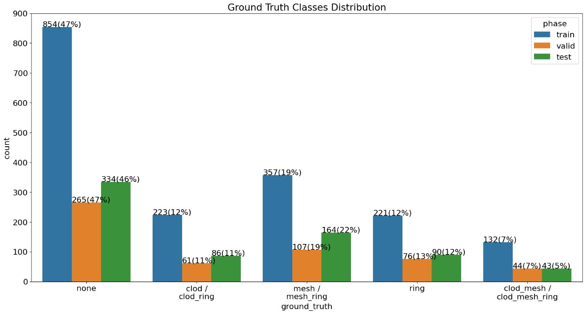

| Class | Train | Validation | Test |
| --- | ---: | ---: | ---: |
| None | 854 | 265 | 334 |
| Mesh / Mesh-Ring | 357 | 107 | 164 |
| Clod / Clod-Ring | 223 | 61 | 86 |
| Ring | 221 | 76 | 90 |
| Clod-Mesh / Clod-Mesh-Ring | 132 | 44 | 43 |
| **Total** | **1,787** | **553** | **717** |

The imbalance is severe: `None` alone is 47% of the data, and the composite class is 7%. This is
what motivates both the loss function and the evaluation metric below.

### Model

`convnext_tiny` from [`timm`](https://github.com/huggingface/pytorch-image-models), ImageNet
pretrained, adapted to single-channel input:

```python
create_model('convnext_tiny', pretrained=True, num_classes=5, in_chans=1, drop_rate=0.85)
```

ConvNeXt was selected after comparing several architectures. It had been published only months
earlier and modernises a ResNet backbone with design choices borrowed from vision transformers.

| | |
| --- | --- |
| Input | 224 x 224, greyscale |
| Optimizer | AdamW, initial lr 1e-6 |
| Scheduler | cosine decay with warm-up (max 1e-4, min 1e-8, 2 warm-up steps, 30 steps down) |
| Epochs | 100 |
| Batch size | 32 |
| Seed | 42 |

Training-time augmentation: full rotation, resize to 254 then random crop to 224, random flips,
brightness/contrast jitter, coarse dropout, and Gaussian noise.

### Cost-sensitive loss

Not every mistake is equally bad. Confusing `Mesh` with `Ring` is a minor error; confusing `Clod`
with `None` is not. The medical team assigned a penalty to each confusion according to its clinical
severity:

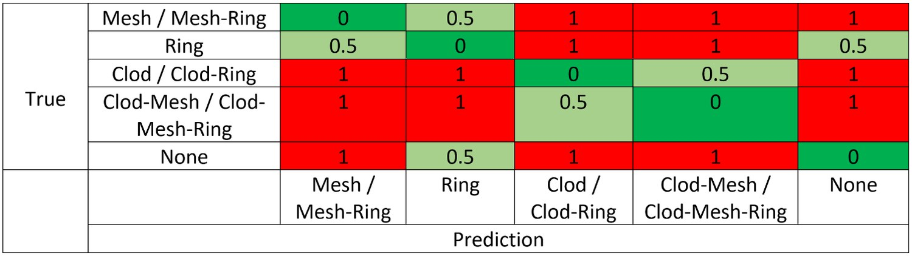

Green is a correct prediction, light green a clinically tolerable confusion, red a serious one. The
same matrix appears verbatim in [`src/train.py`](src/train.py) as `punish_matrix` and is used two
ways:

1. **In the loss.** `CostSensitiveRegularizedLoss` adds a penalty term on top of a focal loss base
   (α = 0.5, γ = 2.0), weighted by λ = 10, so the optimiser is pushed away from clinically costly
   confusions rather than merely wrong ones.
2. **In the metric.** See below.

---

## Results

### Tile-level classification

| Metric | Score |
| --- | ---: |
| Accuracy | **90.7%** |
| Precision | 77.0% |
| Recall | 76.9% |
| F1 | 76.7% |

**What these numbers mean.** They are *clinically weighted*, not standard top-1. Per class, false
positives and false negatives are multiplied by the penalty matrix (normalised to 0 / 0.5 / 1)
before the metric is computed, and the per-class scores are averaged weighted by class support. A
confusion the clinicians consider harmless counts half; a serious one counts fully.

For reference, plain unweighted top-1 accuracy on the same test set is **73.6%**. The gap between
the two is exactly the point: it says most of the model's mistakes are the tolerable kind. Both
numbers are reproducible from the confusion matrix below and the implementation in
[`src/train.py`](src/train.py) (`calc_metrics_new`) and [`src/inference.ipynb`](src/inference.ipynb).

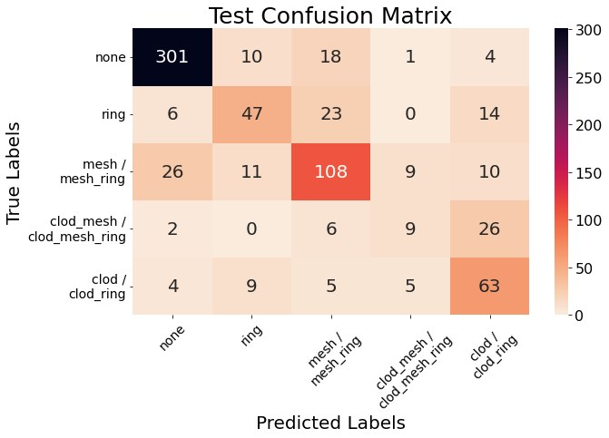

<sub>Test set, 717 tiles. Reading the diagonal: the model is strong on `None` and `Mesh`, weakest on
`Clod-Mesh / Clod-Mesh-Ring`, the rarest class at 43 test samples, which it most often confuses with
`Clod / Clod-Ring`. That confusion carries a low clinical penalty.</sub>

### Segmented mosaics

Every tile prediction is painted back onto the mosaic, giving the clinician a single image of the
whole lesion.

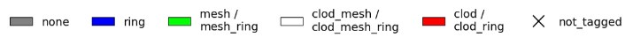

| | |
| :---: | :---: |
| 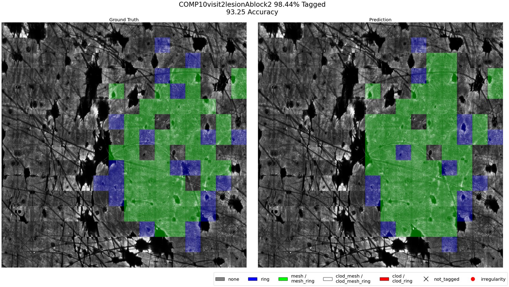 | 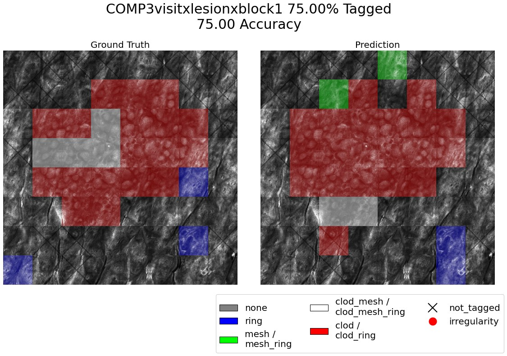 |
| 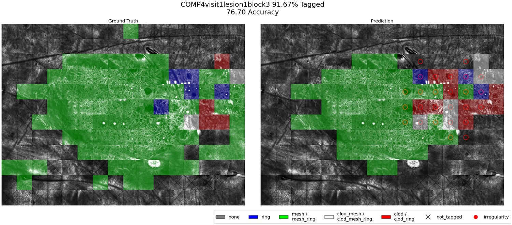 | |

### Irregularity index

A fully coloured mosaic can still be too much information. So a second annotation layer flags
*disagreement between neighbours*: a 3 x 3 window slides across the mosaic, and if the nine tiles
carry three or more different predictions (ignoring `None`, which is background rather than a
pattern), the centre tile is circled in red.

Areas of high pattern variability are exactly the asymmetric, heterogeneous regions clinicians are
trained to treat as suspicious, so this points them at where to look.

| Prediction | Irregularities |
| :---: | :---: |
|  |  |

### Prototypes at the mosaic level

Proof of feasibility for recognising prototypical composite structures at the whole-lesion level,
rather than tile by tile.

| Ground truth | Prediction |
| :---: | :---: |
| 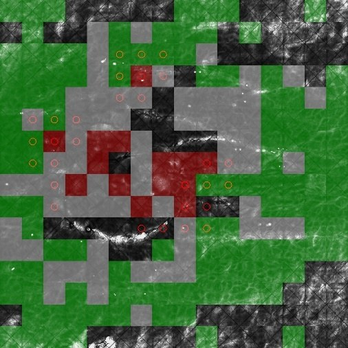 | 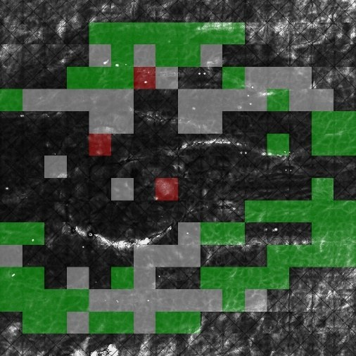 |

---

## Mosaic Annotation Viewer

Labelling is tedious and drifts between annotators. Worse, the team was labelling one tile at a time
with no view of its surroundings, so tiles were being judged out of context.

So the project added a desktop tool that overlays the team's own labels onto the full mosaic. They can toggle
individual classes on and off, adjust overlay opacity and tile size, and see labelling coverage per
mosaic.

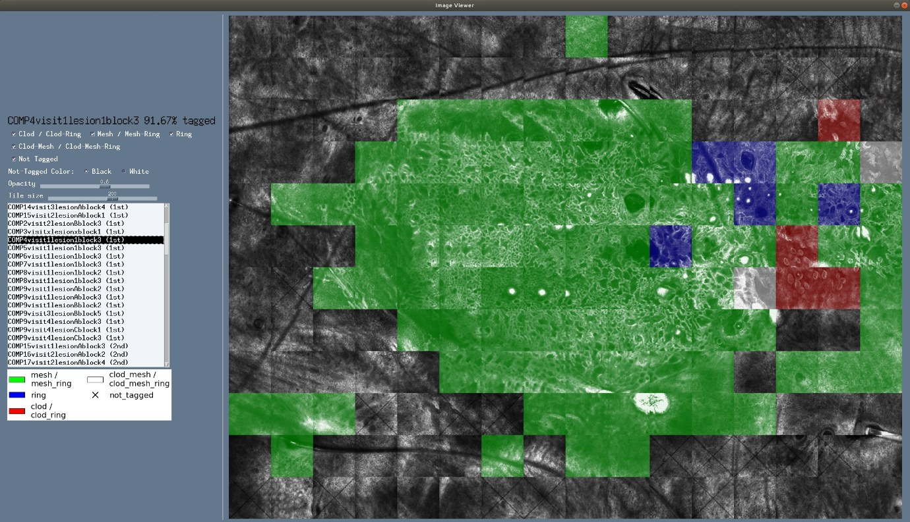

The screenshot shows why it mattered: a `Ring` tile sitting inside a field of `Mesh` tiles. Seen
alone it reads one way; seen in context the annotator may well revise it. The tool changed how the
data was labelled, not just how it was reviewed.

---

## Repository structure

```
src/
├── train.py                 training loop, metrics, W&B logging
├── data.py                  dataset, splits, class maps, augmentation
├── model.py                 ConvNeXt wrapper (timm)
├── cost_sensitive_loss.py   clinically weighted loss
├── scheduler.py             cosine decay with warm-up
├── utils.py                 seeding, run directories, confusion matrices
├── anot_mosaic.py           renders ground-truth mosaics from labelled tiles
├── mosaic_annotator.py      Mosaic Annotation Viewer (PySimpleGUI)
├── inference.ipynb          inference, metrics, segmentation, irregularities
└── READ.ME                  original file descriptions from the submission

assets/                      figures used in this README
NOTES.md                     what was fixed after submission, and what was not
```

---

## Running the code

**The dataset is not in this repository and cannot be shared.** The RCM images are patient-derived
clinical data from Sheba Medical Center. Without them the training and inference code will not run.

The code is also written against absolute paths on the machine it was developed on
(`/home/linuxu/Desktop/...`) and pinned to mid-2022 library versions. See [NOTES.md](NOTES.md) for
the full list of what would need changing to run it elsewhere.

```bash
pip install -r requirements.txt
```

This repository is published as a record of the work, not as a reusable package.

---

## Conclusions

- All four project goals were met.
- Merging eight classes into five was both more clinically correct and better for the model. Model
  design decisions here were driven by clinical reasoning, not only by validation scores.
- How results are *visualised* matters as much as the results themselves. Continuous dialogue with
  the medical team was what made the output usable.
- For mosaic segmentation, classifying at the tile level is clinically preferable to the pixel-level
  approach the literature favours.
- Deep learning on RCM images can save expert time and give a solid starting point for further
  analysis. With larger datasets and stronger models it is plausible as part of routine screening.

## Future work

- Extend to malignant lesions (melanoma) and measure performance there.
- Label in batches of four tiles rather than one, so spatial context is built into the labels.
- Lower the labelling decision threshold to surface many more composite-pattern tiles and enrich the
  dataset.
- Explore ensembles, attention, and class activation maps.

---

## Poster

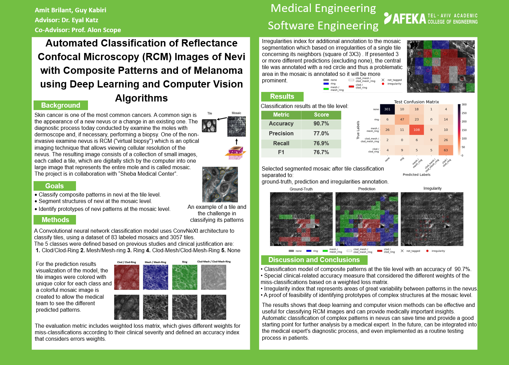

---

## Credits

Supervised by **Dr. Eyal Katz** (Afeka Tel-Aviv Academic College of Engineering) and
**Prof. Alon Scope** (Sheba Medical Center). Thanks to Prof. Scope's research team at Sheba for
their work on data collection and labelling.

Published as an academic portfolio record. All rights reserved.
